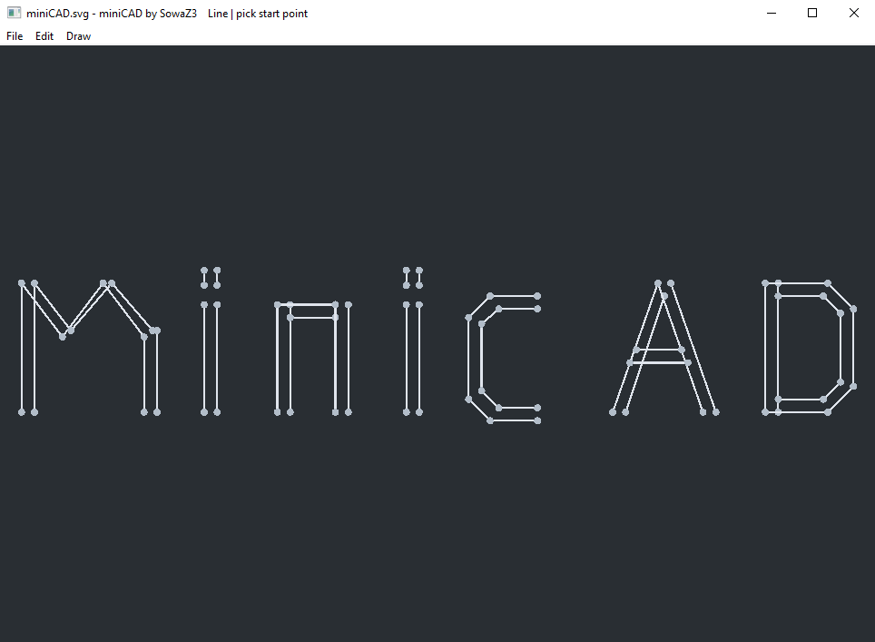

<p align="center">
  
</p>

<h1 align="center">miniCAD</h1>

miniCAD is a lightweight 2D drawing tool for building polylines and arcs with a simple CAD-style workflow. It focuses on fast editing, endpoint snapping, keyboard-assisted precision input, and SVG-based save/load.

## Requirements

- Embarcadero C++Builder
- Windows

## Features

- Draw line-based polylines.
- Draw circular arcs.
- Lock the drawing direction to the four orthogonal directions (`up`, `right`, `down`, `left`) by holding `Shift`.
- Type an exact segment length while drawing.
- Build arcs using an startpoint first and then:
  - click a point on the desired arc side, or
  - type a radius and confirm it.
- Keep arc joins tangent to the previous segment.
- Snap to segment endpoints and continue drawing from existing geometry.
- Select segments when clicking away from snap handles.
- Delete selected segments with `Del`.
- Undo and redo editing steps.
- Zoom in and out with the mouse wheel.
- Pan the workspace with the middle mouse button.
- Open drawings from `.svg`.
- Save drawings to `.svg`.
- Export drawings to `.svg`.
- Start a new document.
- Switch between `Line` mode and `Arc` mode.
- Use both a top menu and a right-click context menu.

## Controls

### Mouse

- `Left Click`:
  - add a line point in `Line` mode,
  - define arc geometry in `Arc` mode,
  - select a segment when no drawing is active and the click is outside snap areas.
- `Middle Mouse Button`:
  - hold and drag to pan the workspace.
- `Mouse Wheel`:
  - zoom in and out around the cursor position.
- `Right Click`:
  - open the context menu.

### Keyboard

- `Shift`:
  - enable orthogonal direction locking while placing the next point.
- `Esc`:
  - finish the current polyline,
  - cancel typed numeric input,
  - clear the current segment selection.
- `Enter`:
  - confirm typed length or typed arc radius,
  - continue the last finished polyline when no numeric input is active.
- `Del`:
  - delete the selected segment.
- `Ctrl+Z`:
  - undo.
- `Ctrl+Y`:
  - redo.
- `Ctrl+O`:
  - open an SVG file.
- `Ctrl+S`:
  - save the current drawing.

## Drawing Workflow

### Lines

1. Start clicking to create a polyline.
2. Hold `Shift` to constrain the next segment to horizontal or vertical direction.
3. While constrained, you can type a precise length and press `Enter`.
4. Press `Esc` to finish the active polyline.
5. Press `Enter` later to continue the last finished polyline.

### Arcs

1. Switch to `Arc` mode.
2. Choose the arc endpoint.
3. Define the arc by either:
   - clicking a point on the desired arc side, or
   - typing a radius and pressing `Enter`.
4. Orthogonal direction locking also works while choosing the arc endpoint.
5. Consecutive arc joins are kept tangent to the previous segment.

## SVG Support

miniCAD uses SVG as its project exchange format.

- `Open` loads geometry from an SVG file and fits the drawing to the viewport automatically.
- `Save` and `Save As` store the current drawing as SVG.
- `Export SVG` writes the drawing to a chosen SVG file.
- Because the drawing is stored as vector geometry, the exported SVG can be printed at a chosen scale.
- This makes it possible to treat the program units as real-world units such as millimeters, centimeters, or other consistent measurement systems during printing and downstream use.

Current SVG import is intended for the geometry generated by miniCAD itself and supports the subset used by the app:

- line segments as SVG `<line>`
- circular arcs as SVG `<path>` with arc commands

## Build

To build the Windows executable from the command line, run:

```bat
cmd /c '"C:\Program Files (x86)\Embarcadero\Studio\23.0\bin\rsvars.bat" && "C:\Windows\Microsoft.NET\Framework\v4.0.30319\MSBuild.exe" Project1.cbproj /t:Build /p:Config=Debug /p:Platform=Win32'
```

The executable is created here:

```text
Win32\Debug\Project1.exe
```

## Notes

- Endpoint snapping helps connect new geometry cleanly to existing segments.
- Selected segment data is shown in the HUD, including arc radius where applicable.
- The application is designed for quick 2D drafting rather than full parametric CAD modeling.
